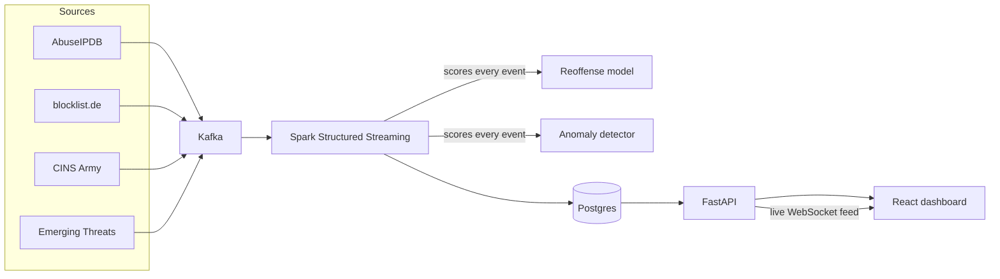

# GhostNet

[](https://github.com/erenntekin/GhostNet/actions/workflows/tests.yml)

A real-time threat intelligence pipeline. IPs from four public blocklists get pulled in, streamed through Kafka and Spark, scored by two trained models, and shown on a live dashboard that tells you what to actually block first.

Not a demo with fake data. Every number on the dashboard comes from a real pipeline processing real, currently-active malicious IPs.


## What it actually does

Four independent feeds (AbuseIPDB, blocklist.de, CINS Army, Emerging Threats) get polled continuously. Every event flows through Kafka into a Spark Structured Streaming job, which scores it with two models before writing it to Postgres:

- **A reoffense risk model.** Given only what's known the instant an IP is first seen, it predicts whether that IP will be reported again. Trained on 24,566 real IPs.
- **An anomaly detector.** An IsolationForest with no labels at all. It flags events that don't look like the rest of the traffic, catching attack patterns nobody wrote a rule for.

A FastAPI backend exposes both models plus pipeline health, geography, attack-category breakdowns, and per-IP lookups. A React dashboard turns all of it into something you can actually act on, including an automated intelligence briefing: ranked, actionable findings regenerated from the pipeline's current state every time the page loads, not written by hand.


See [docs/FEATURES.md](docs/FEATURES.md) for a full walkthrough of every page and feature, including the MITRE ATT&CK mapping, the automated intelligence briefing, and the IP/CIDR lookup dossier.

## By the numbers

| | |
|---|---|
| Reoffense model recall | **93%** of IPs that do reoffend get caught |
| Reoffense model precision | **45%** of flagged IPs actually reoffend |
| Trained on | 24,566 real IPs, 37,631 events for the anomaly model |
| Data sources | 4 independent feeds, cross-checked against each other |
| API surface | 16 endpoints |

The recall number is the one that matters here. A missed reoffender costs more than chasing a false alarm, so the higher-recall model is the one actually deployed, not the one with the prettier accuracy score. That tradeoff is explained on the dashboard itself, not just in this README.


Every attack category is also mapped to its real MITRE ATT&CK technique and tactic, hand-built from AbuseIPDB's 23 report categories, not a generic label:


## How it's built



Kafka decouples ingestion from processing, so a slow feed or a Spark restart never blocks the others. Spark does the actual scoring in the same job that writes to Postgres, so nothing on the dashboard is computed after the fact.

Full technical breakdown, model comparison, confusion matrix, feature importance:


## Design decisions worth knowing about

**Postgres, not Snowflake.** This project used to run on Snowflake. It was moved to Postgres once it became clear that a distributed data warehouse was solving a scaling problem this project doesn't have, tens of thousands of rows and one dashboard don't need it. The Snowflake setup script is kept in `storage/setup_snowflake.py` purely as a record of that decision.

See [docs/FEATURES.md](docs/FEATURES.md) for the rest of the reasoning behind the pipeline, including why the live map can't inflate the real numbers and how corroboration and data quality checks actually work.

## Running it

Requires Docker.

```bash
git clone https://github.com/erenntekin/GhostNet.git
cd GhostNet
cp .env.example .env
docker compose up -d
```

Dashboard: `http://localhost:5173`
API docs: `http://localhost:8001/docs`

The two models ship pre-trained (`ml/*.joblib`). To retrain on fresh data: `python ml/train_reoffense_model.py` and `python ml/train_anomaly_model.py` (needs `pip install -r ml/requirements.txt`).

## Tests

```bash
pip install -r requirements-dev.txt
pytest tests/
```

25 tests covering the core logic (Gini coefficient, anomaly percentile scoring, rarest-feature reasoning) and the main API endpoints against a real database.

## Stack

| | |
|---|---|
| Python | One language across ingestion, scoring, and the API, no context-switching between the pieces that actually talk to each other |
| Kafka | Decouples ingestion from processing, a slow or down feed never blocks the others |
| Spark Structured Streaming | Runs both models inline with ingestion, in the same job that writes to Postgres, instead of as a separate offline batch step |
| PostgreSQL | Replaced Snowflake once it was clear a distributed warehouse was solving a scale problem this project doesn't have, see below |
| scikit-learn | The two models are a RandomForest classifier and an IsolationForest, both standard tabular algorithms, no need for a deep learning framework at this data volume |
| FastAPI | Async support for the live WebSocket feed alongside regular sync DB queries, plus free OpenAPI docs at `/docs` |
| React | The dashboard is state-heavy and WebSocket-driven, components made that easier to reason about than templating |
| Vite | Fast dev server, mattered more than usual given how many small visual iterations this dashboard went through |

## Known limitations

- **Live per-IP lookups are capped by AbuseIPDB's free tier** (1,000/day). When that's exhausted, the dossier falls back to this pipeline's own history and independent geolocation instead of failing outright, but it stops being able to confirm anything new from AbuseIPDB itself.
- **Most events carry no specific attack category.** AbuseIPDB's bulk feed, the majority of the dataset, doesn't report one. The MITRE ATT&CK mapping only applies to the ~35% of events that do.
- **"Real-time" has a floor, not zero latency.** Spark writes to Postgres in 5-minute micro-batches, not row by row. An event can be seen the instant it's ingested on the Live page (that part really is instant), but it takes up to 5 minutes to land in the historical numbers on the Data page.
- **Runs locally only, for now.** There's no public deployment or authentication layer, it's meant to be cloned and run, not exposed as-is on the open internet.

## Possible extensions

- **Run it continuously, on a public host.** Right now the pipeline only ingests while `docker compose up` is running locally, so data goes stale between sessions. The same `docker-compose.yml` would run as-is on a small always-on VPS, which solves that and makes the dashboard reachable by URL instead of requiring a local clone.
- **A honeypot as a fifth source.** The four current feeds are all third-party aggregations. A decoy service would give first-party behavioral data, what an attacker actually does, not just that they were reported elsewhere.
- **Push alerts instead of a passive dashboard.** Once the pipeline runs unattended, someone still has to open the page to see what needs action. A webhook that notifies on every IP confirmed by 2+ independent sources would turn "What to block first" into something that reaches you instead of waiting to be checked.

## License

All rights reserved. See [LICENSE](LICENSE). This is a portfolio project, code is here to look at, not to reuse.
