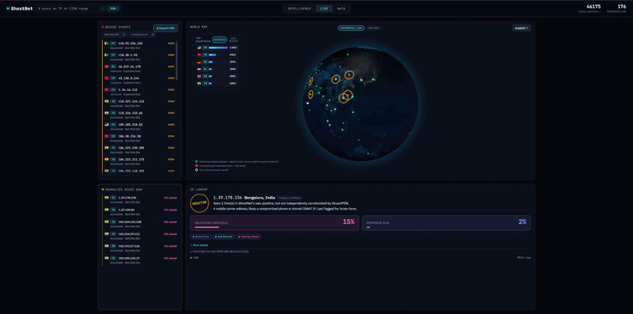
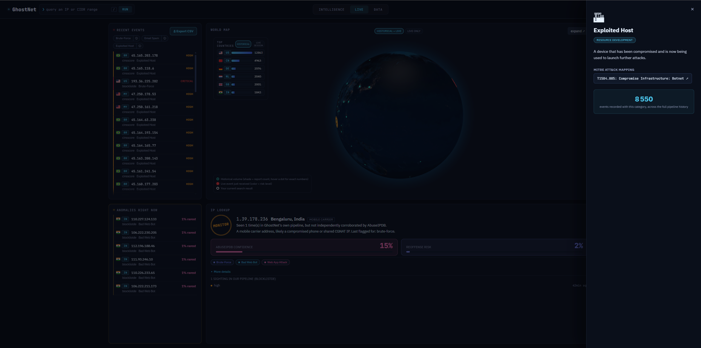
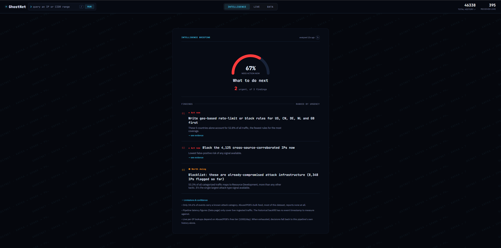
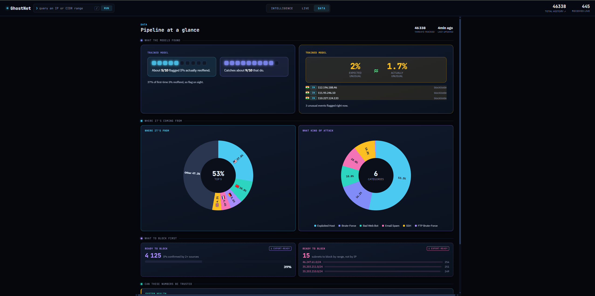
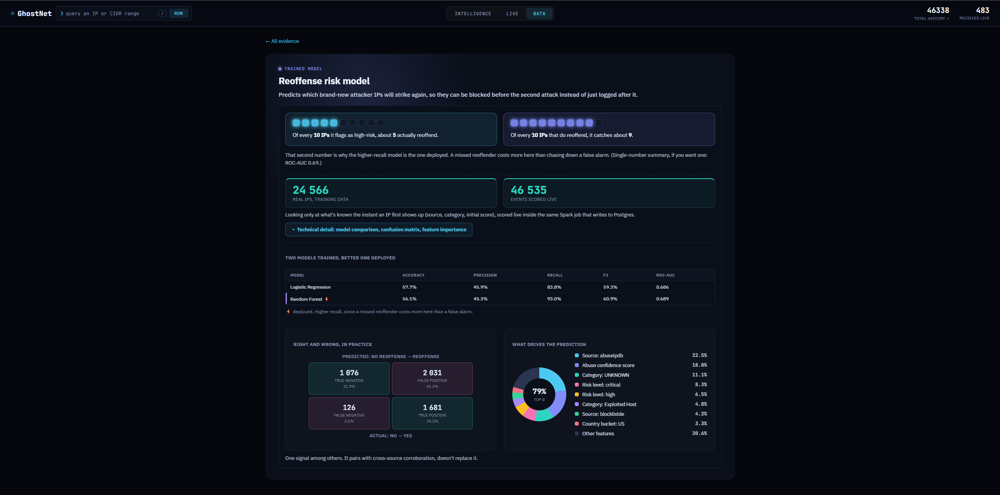
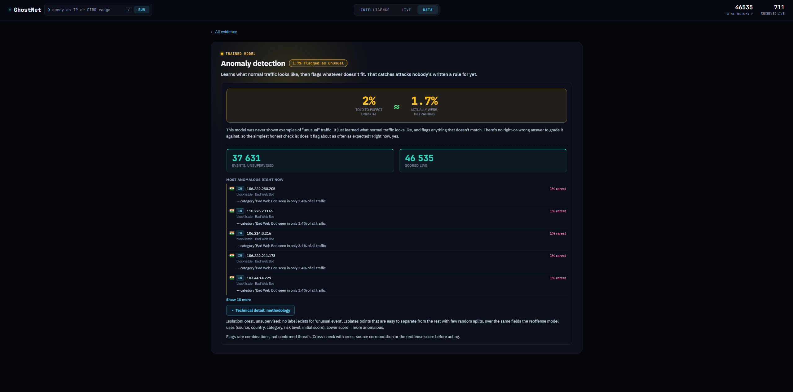
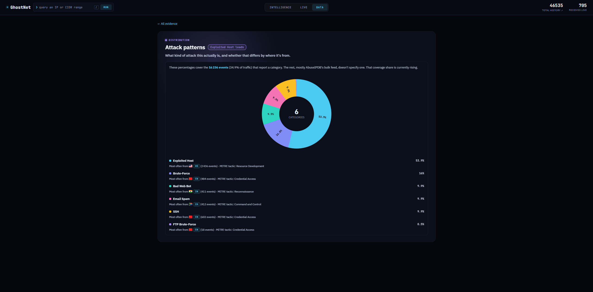
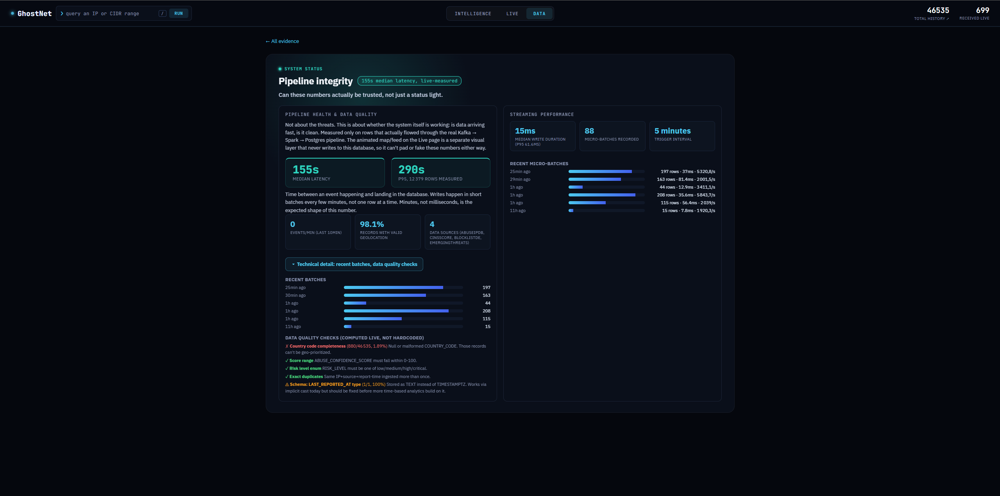
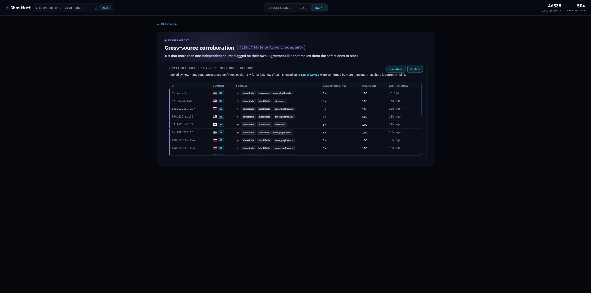
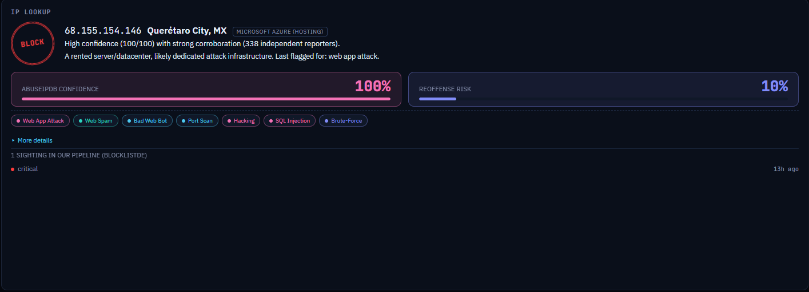

# Feature tour

Everything below is real. No mock data, no placeholder numbers. Every screen reads from the same Postgres database the live pipeline writes to.

The app has three pages: **Live**, **Intelligence**, and **Data**. Any IP or CIDR range can be looked up from any of them.

## Header

Present on every page, not just decoration.

The GhostNet logo doubles as a live connection indicator. It pulses blue when the WebSocket feed is connected, and turns red with an "offline" badge the moment it drops, so a broken connection is never silent. Clicking it jumps back to Live from anywhere.

The search bar is styled like a terminal on purpose, a `❯` prompt, a `run` button, and a global `/` keyboard shortcut that focuses it from any page, the same convention GitHub's own search uses. Type an IP or a CIDR range and hit run.

On the right, two counters. **Total history** is the full row count in Postgres and doubles as a link straight into the raw history explorer. **Received live** counts what this specific browser session has actually received over the WebSocket, a different, smaller number on purpose, it's proof the feed is live, not the size of the dataset.

## Live

The default view. Built to answer one question: what's happening right now.

### World map

A 3D globe with two modes. **Historical + live** shades every country by how many threats it has ever produced, so the shape of the whole dataset is visible at a glance. **Live only** clears that and shows just pulses from the current browser session, color-coded by risk level as they land. Click a country to filter the rest of the page down to it. The map can expand to full screen.

### Recent events

A live-updating feed of individual events as they arrive, each one clickable to pull up the full IP dossier. Filterable by attack type, with an info icon on each category that opens a definitions drawer (see below). One click downloads exactly what's on screen as a CSV, IP, country, risk level, and timestamp, filtered the same way the feed is filtered.

### Anomalies right now

The output of the unsupervised anomaly model, live. Each entry shows why it was flagged: which of its own fields (source, country, category) is rarest across the whole dataset. Not a fixed rule, a live comparison against real traffic patterns.

### Attack category definitions and MITRE ATT&CK mapping

Click the info icon on any category and a drawer opens with a plain-language definition, the number of times that category has actually occurred across the full pipeline history, and its real MITRE ATT&CK technique ID and tactic, linked directly to attack.mitre.org. This is a genuine mapping built by hand from AbuseIPDB's 23 report categories to the ATT&CK framework, not a generic label.

## Intelligence

An automated briefing, regenerated from the pipeline's own current state every time it loads. Nothing on this page is written by hand.

A posture gauge shows what share of findings need action now. Below it, findings are ranked by urgency, each one a concrete action paired with its impact, for example blocking the IPs confirmed by more than one independent source, or writing geo-based rules for the five countries producing most of the traffic. Every finding links straight back to the Data exhibit that backs it up.

A limitations section is included on purpose. It states plainly what the analysis can't see, for example that most of the dataset carries no attack category at all, or that live per-IP lookups are capped by AbuseIPDB's free tier. An analysis that only reports good news isn't trustworthy.

## Data

A dashboard of seven exhibits, each answering a different question about the pipeline. Every card previews the same visual you get after clicking into it, no bait and switch.

**What the models found.** Two trained models, shown as their own natural-language claims instead of a bare accuracy number. The reoffense model: out of every 10 IPs it flags as high risk, about 5 actually reoffend, and it catches about 9 out of every 10 that do. That second number is why the higher-recall model is the one deployed, a missed reoffender costs more here than a false alarm. Expand "Technical detail" for the full comparison between the two models tried, the confusion matrix, and which features actually drive the prediction. The anomaly model gets its own honest check: it was told to expect 2% of events as unusual, and in training it flagged 1.7%, close enough that the model is calibrated correctly.

**Where it's coming from.** A donut showing which countries and which attack categories the traffic actually breaks down into, with the real share on the ring itself, not hidden in a tooltip. Each category in the full breakdown also carries its dominant source country and MITRE tactic, the same mapping used on the Live drawer, aggregated across the whole dataset.

**What to block first.** IPs confirmed by two or more independently-operated sources, ranked above IPs merely seen many times by one feed, because independent agreement is a stronger signal. Also, entire /24 subnets flagged for renting out 3 or more malicious IPs at once, since blocking the range stops the next one before it starts. This is where the blocklist exports live, see below.

**Can these numbers be trusted.** Real pipeline health, not a status light. Ingestion latency, data quality checks computed live against the current data (not hardcoded), and Spark's own streaming write performance. This exhibit is honest about what it can't see too: it explicitly can't be padded by the animated Live map, because that layer never writes to this database.

**Full raw history.** Every record, every field, searchable and exportable. The receipts behind every number on the rest of the page.

## Exports: what you actually walk away with

A threat intelligence tool that only displays numbers isn't finished. Everything analyzed here can leave the browser as a file ready to drop straight into a firewall, no copy-pasting IPs out of a table by hand.

**Blocklist, ranked by corroboration.** From "What to block first," one button downloads `ghostnet-blocklist.sh`, a ready-to-run shell script, one line per IP: `iptables -A INPUT -s <ip> -j DROP`. Another downloads `ghostnet-denylist.conf` in nginx's own `deny <ip>;` format. Both are ordered by cross-source corroboration, the strongest candidates first, not by whichever row happened to load first.

**Subnet blocklist.** From "Shared infrastructure," `ghostnet-subnet-denylist.conf` lists every /24 range with 3 or more independently-flagged IPs, one `deny <subnet>;` line each. Blocking a rented block that's already produced multiple attackers stops the next one before it's even assigned.

**Live feed CSV.** From the Live page, whatever's currently on screen (already filtered by attack type if a filter is active) downloads as `ghostnet-feed-<timestamp>.csv`.

None of these are static snapshots frozen at build time. Every export is generated from whatever the database holds at the moment the button is clicked.

## IP and CIDR lookup

Available from a search bar on every page. Two different result types depending on what's typed in.

**A single IP** returns a dossier: a one-word verdict (block, monitor, or insufficient data) stamped at the top, a plain-language reason for it, a live AbuseIPDB check alongside this pipeline's own independent history for that IP, and, when available, our own reoffense model's predicted probability with the specific reasons behind it (which field made this IP stand out). Origin is flagged too: Tor exit node, VPN or proxy, hosting/datacenter infrastructure, or mobile carrier, each one a different risk profile. If AbuseIPDB's free tier is exhausted, the dossier still returns independent geolocation data instead of failing outright.

**A CIDR range** (for example `1.2.3.0/24`) returns every flagged IP inside that block, with a count of how many are cross-source confirmed.

## What's underneath

Kafka decouples the four ingestion sources from processing, so a slow feed never blocks the others. Spark Structured Streaming scores every event with both models in the same job that writes to Postgres, so nothing shown here is computed after the fact or on a delay. A separate visual-only layer (`live_replay.py`) drives the pulsing map on the Live page by replaying historical events, and writes to a different Kafka topic entirely, so it can never inflate or fake a single number the rest of the app reports.

See the [main README](../README.md) for the architecture diagram and how to run it locally.
